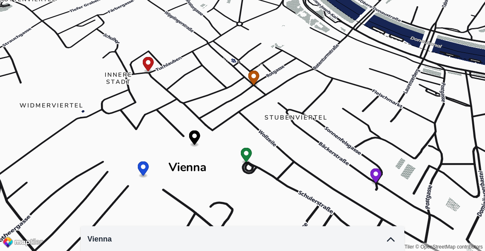

<div align="center">

# Anonymous Location


### Share your location, not your identity.

[](https://github.com/hschne/anonymous-location/actions/workflows/main.yml)
[](https://img.shields.io/github/license/hschne/anonymous-location)

</div>

## Usage

<div align="center">

</div>

Visit https://anonymouslocation.com to share your location. Create a new location by clicking on the map. 

You'll be given a unique link which you can share. Any connected client has the option to "join" the location by sharing their coordinates. Movements of individual clients will shared live on the map. 

## Development

This is a Ruby on Rails application. To get started, clone the repo, install dependencies and prepare the database. 

```bash
bundle install
rails db:setup
```

The start the server with 

```bash
bin/dev
```

### Testing

Anonymous Location uses Minitest for testing. Run the test suite with

```bash
rails test
```

### Deployment

Anonymous Location is automatically deployed via GitHub actions using [Kamal](https://kamal-deploy.org/). To manually deploy you'll need SSH access to the server and access to the Docker Hub registry.

```bash
kamal setup
kamal deploy
```
